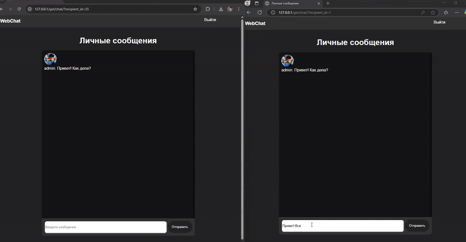

# Web Chat Application

## Overview
A real-time web chat application built with WebSockets. This project allows users to:
- Chat in real-time with other users.
- Cache the last 500 messages in Redis for quick retrieval.
- Manage user profiles.
- Search for users and add them as friends.

The front-end is implemented with JavaScript, HTML, and CSS, located in the `frontend/` directory. Templates are rendered using a backend route system with `TemplateResponse`.

## Features
- **Real-Time Messaging:** Powered by WebSockets for instant communication.
- **Message Caching:** Stores up to 500 recent messages per chat room in Redis for fast access.
- **User Profiles:** View and update profiles, including avatars.
- **Friend Management:** Search users and manage a friend list.
- **Simple UI:** User-friendly interface built with HTML, CSS, and JavaScript.

## Tech Stack
### Backend
- **Framework:** FastAPI
- **Database:** PostgreSQL 
- **Cache:** Redis
- **Authentication:** JWT-based

### Frontend
- **Languages:** JavaScript, HTML, CSS

### Set Up Environment Variables

Copy the example environment file to create your .env file:

Open .env and fill in the necessary fields, such as database credentials, Redis settings, and application secrets.

### Launching the Application

Build and start the application using Docker Compose:

docker-compose up --build

Open your browser and navigate to:

http://localhost
The application will be available at this address.

### Running Tests
To run the automated tests:

Ensure the testing environment variables are configured in .env.test.

Use the test-specific Docker Compose file to execute tests:

docker-compose -f docker-compose.test.yaml up --build

--------
## Обзор
Веб-чат приложение в реальном времени, построенное с использованием WebSockets. Этот проект позволяет пользователям:
- Общаться в реальном времени с другими пользователями.
- Кэшировать последние 500 сообщений в Redis для быстрого извлечения.
- Управлять профилями пользователей.
- Искать пользователей и добавлять их в друзья.

Фронтенд реализован на JavaScript, HTML и CSS, расположенных в директории `frontend/`. Шаблоны отображаются с помощью бэкенд-системы маршрутов с `TemplateResponse`.

## Особенности
- **Обмен сообщениями в реальном времени:** Работает на основе WebSockets для мгновенного общения.
- **Кэширование сообщений:** Хранит до 500 последних сообщений в чате в Redis для быстрого доступа.
- **Профили пользователей:** Просмотр и обновление профилей, включая аватары.
- **Управление друзьями:** Поиск пользователей и управление списком друзей.
- **Простой пользовательский интерфейс:** Удобный интерфейс, построенный на HTML, CSS и JavaScript.

## Технический стек
### Бэкэнд.
- **Фреймворк:** FastAPI
- **База данных:** PostgreSQL 
- **Кэш:** Redis
- **Аутентификация:** JWT-based

### Frontend
- **Языки:** JavaScript, HTML, CSS

### Настройка переменных окружения

Скопируйте пример файла окружения, чтобы создать свой файл .env:

Откройте .env и заполните необходимые поля, такие как учетные данные базы данных, настройки Redis и секреты приложения.

### Запуск приложения

Соберите и запустите приложение с помощью Docker Compose:

docker-compose up --build

Откройте браузер и перейдите по адресу:

http://localhost.
Приложение будет доступно по этому адресу.

### Запуск тестов
Чтобы запустить автоматизированные тесты:

Убедитесь, что переменные окружения для тестирования настроены в .env.test.

Используйте файл Docker Compose для выполнения тестов:

docker-compose -f docker-compose.test.yaml up --build